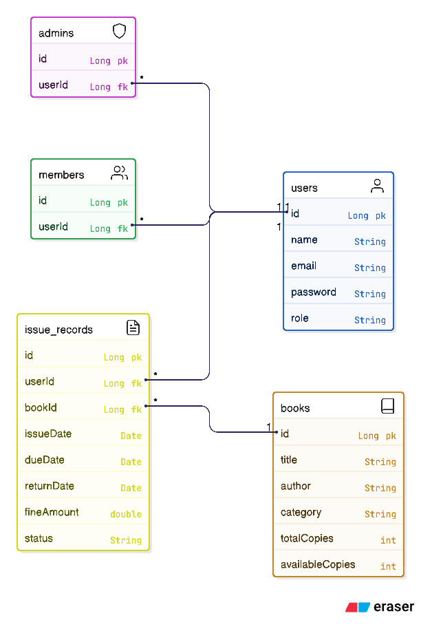

# Class Diagram – Library Management System

----------------------------------
ABSTRACT CLASS
----------------------------------

User
- id : Long
- name : String
- email : String
- password : String
- role : String
+ login()
+ logout()

----------------------------------
INHERITED CLASSES
----------------------------------

Admin extends User
+ addBook()
+ updateBook()
+ deleteBook()
+ manageUsers()

Member extends User
+ searchBook()
+ issueBook()
+ returnBook()
+ viewMyIssuedBooks()

----------------------------------
OTHER CLASSES
----------------------------------

Book
- id : Long
- title : String
- author : String
- category : String
- totalCopies : int
- availableCopies : int
+ updateAvailability()

IssueRecord
- id : Long
- issueDate : Date
- dueDate : Date
- returnDate : Date
- fineAmount : double
- status : String
+ calculateFine()

----------------------------------
RELATIONSHIPS
----------------------------------

User 1 ----- * IssueRecord  
Book 1 ----- * IssueRecord  

Admin  ----|>  User  
Member ----|>  User
